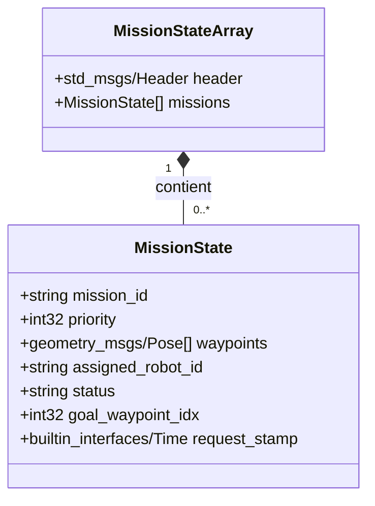
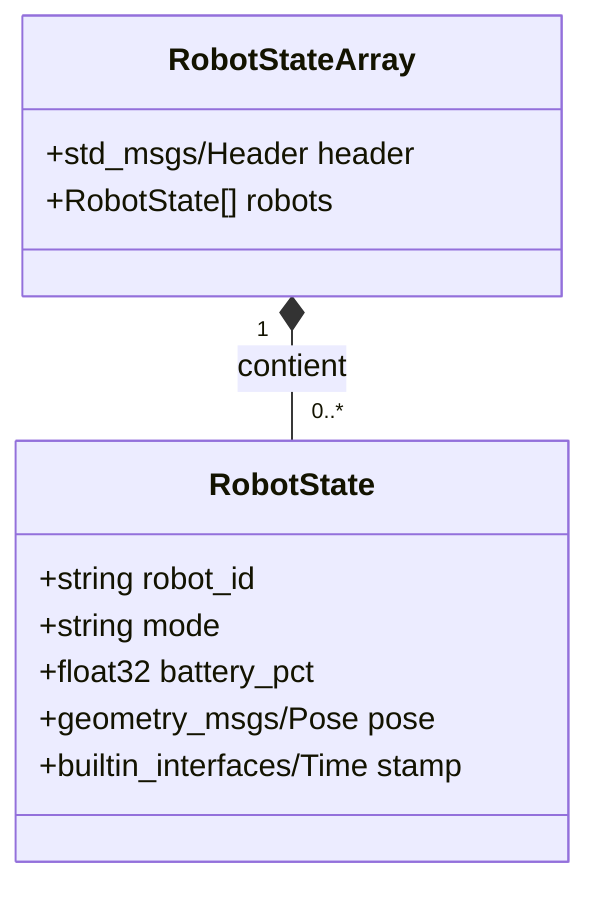

# fleet_interfaces

## 1 - Vue d'ensemble

Le package **`fleet_interfaces`** constitue la bibliothèque de définitions de types pour le projet **Coflot**. Il assure la génération des interfaces ROS 2 (messages) nécessaires à la communication entre les différents nœuds du système.

### Fonctions du package

- **Définition des types de messages de gestion de la flotte** : Etats des robots, états des mission, demandes de mission, etc
- **Compatibilité avec les outils utilisés** : Utilisation d'interfaces standard et de *Nav2*

### Arborescence

```
fleet_interfaces/
├── CMakeLists.txt
├── package.xml
└── msg/
    ├── MissionRequest.msg
    ├── MissionState.msg
    ├── MissionStateArray.msg
    ├── RobotState.msg
    └── RobotStateArray.msg
```

## 2 - Intégration et Compilation

Ce package s'intègre comme une dépendance dans d'autres packages ROS 2. Il utilise le système de build ament_cmake.

### Compilation

La génération des interfaces s'effectue lors de la compilation de l'espace de travail :
```bash
colcon build --packages-select fleet_interfaces
```

### Dépendances Requises

Pour utiliser les messages définis ici, les packages consommateurs doivent déclarer les dépendances suivantes :

#### Dans `package.xml` :
```xml
<depend>fleet_interfaces</depend>
```
#### Dans `CMakeLists.txt` :
```cmake
find_package(fleet_interfaces REQUIRED)
```

## 3 - Définition des Messages

Le package exporte cinq types de messages, dépendants des types standards `std_msgs` et `geometry_msgs`.

### MissionRequest.msg

Structure utilisée pour la soumission d'une nouvelle mission.

| Champ | Type | Description | 
| :--- | :--- | :--- | 
| `header` | *std_msgs/Header* | En-tête standard (timestamp, frame). | 
| `mission_id` | *string* | Identifiant unique de la mission. | 
| `priority` | *int32* | Niveau de priorité (valeur élevée = priorité haute). | 
| `waypoints` | *geometry_msgs/Pose[]* | Liste ordonnée des positions cibles à visiter. |

### MissionState.msg

Représente l'état courant d'une mission individuelle.

| Champ | Type | Description |
| :--- | :--- | :--- |
| `mission_id` | *string* | Identifiant unique de la mission. | 
| `priority` | *int32* | Niveau de priorité (0=Normal, 1=High, 2=Urgent). | 
| `waypoints` | *geometry_msgs/Pose[]* | Séquence des points de passage. | 
| `assigned_robot_id` | *string* | ID du robot affecté (chaîne vide si non affecté). | 
| `status` | *string* | État du cycle de vie (ex: PENDING, ASSIGNED, DELIVERING, FINISHED). | 
| `goal_waypoint_idx` | *int32* | Index du waypoint cible actuel (-1 si non commencé). | 
| `request_stamp` | *builtin_interfaces/Time* | Horodatage de la requête initiale. |

### MissionStateArray.msg

Vecteur contenant l'état de l'ensemble des missions.

| Champ | Type | Description |
| :--- | :--- | :--- |
| `header` | *std_msgs/Header* | En-tête global pour la synchronisation. |
| `missions` | *MissionState[]* | Liste des missions gérées par le système. |

### RobotState.msg

Données de télémétrie pour un robot unique.

| Champ | Type | Description |
| :--- | :--- | :--- |
| `robot_id` | *string* | Identifiant unique du robot (namespace). | 
| `mode` | *string* | Mode opérationnel actuel. | 
| `battery_pct` | *float32* | Niveau de batterie (0.0 à 100.0). | 
| `pose` | *geometry_msgs/Pose* | Position et orientation sur la carte. | 
| `stamp` | *builtin_interfaces/Time* | Horodatage de la donnée. |

### RobotStateArray.msg

Vecteur contenant les états de tous les robots de la flotte.

| Champ | Type | Description |
| :--- | :--- | :--- |
| `header` | *std_msgs/Header* | En-tête global. |
| `robots` | *RobotState[]* | Liste des états des robots connectés. |

## 4 - Structure des Données

Les messages sont structurés selon un modèle de composition hiérarchique permettant l'agrégation des données.

### Diagramme de Structure : Missions

Le message `MissionStateArray` encapsule une liste dynamique de messages `MissionState`.



### Diagramme de Structure : Robots

Le message `RobotStateArray` encapsule une liste dynamique de messages `RobotState`.

