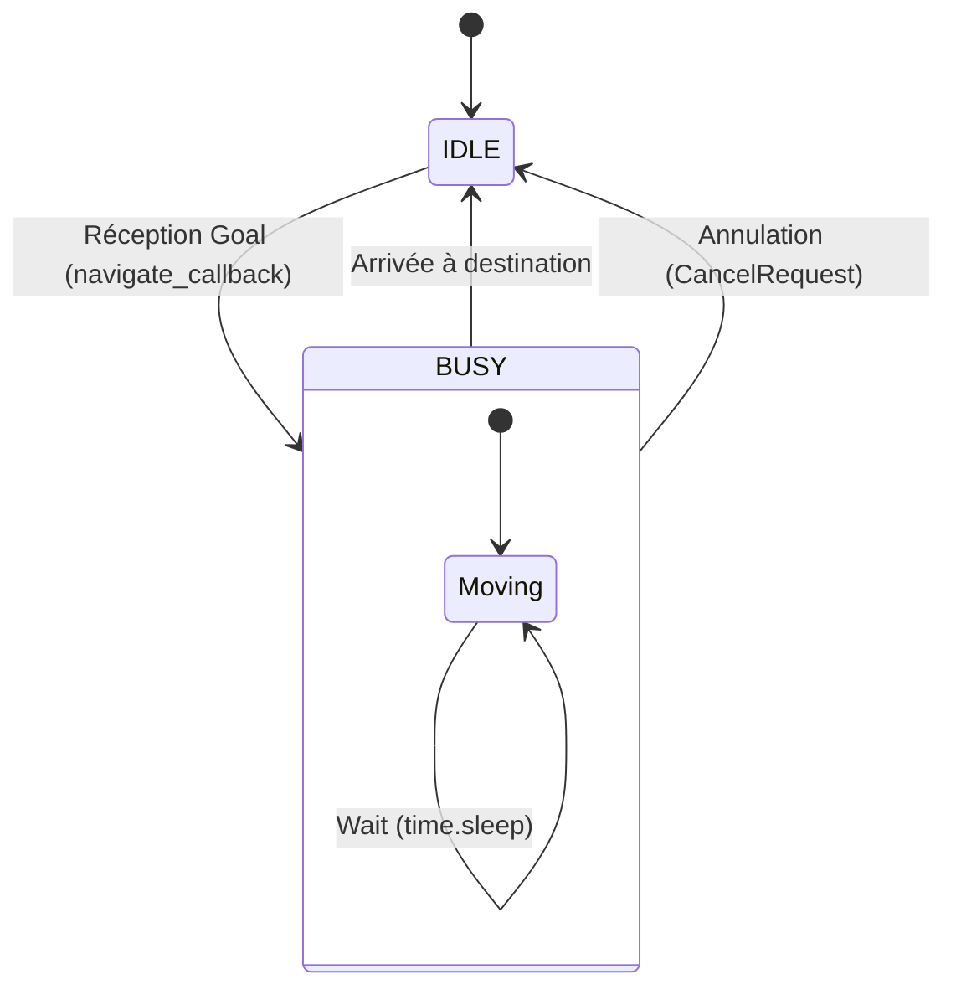

# fleet_simulation

## 1 - Vue d'ensemble

Le package `fleet_simulation` fournit un environnement de simulation léger pour le projet Coflot. Il remplace la couche matérielle (drivers robots) et la stack de navigation (Nav2) réelle pour permettre le développement et le test des couches décisionnelles supérieures (comme le `mission_manager`). 

### Rôle fonctionnel

1. **Virtualisation de la flotte** : Instanciation de robots virtuels (robot_1, robot_2) avec un état interne (position, batterie, statut).
2. **Simulation des interfaces Nav2** : Exposition de serveurs d'action standards (MapsToPose, ComputePathToPose) qui imitent le comportement de la navigation réelle (délais de déplacement, consommation batterie).
3. **Télémétrie** : Publication centralisée de l'état de la flotte.

### Arborescence

```
fleet_simulation/
├── fleet_simulation/
│   └── fleet_simulation.py   # Nœud principal (MockFleetNode)
├── launch/
│   └── simulation.launch.py  # Fichier de lancement (Map + Simu)
├── maps/                     # Dossier contenant les fichiers de carte (glob)
├── package.xml
└── setup.py
```

## 2 - Utilisation et Lancement

### Exécutables (ros2 run)

Le nœud de simulation principal se lance avec l'exécutable `fleet_simulation` :

```bash
ros2 run fleet_simulation fleet_simulation
```

L'exécutable accepte le paramètres `sim_speed` via la ligne de commande :

```bash
ros2 run fleet_simulation fleet_simulation --ros-args -p sim_speed:=2.0
```

### Launch Files (ros2 launch)

Un fichier de lancement est fourni pour démarrer le serveur de carte et la simulation simultanément.

> **Note :**
> Le launche file ne doit pas être utilisé. Il faut lancer directement l'exécutable `fleet_simulation`. Pour interagir avec l'IHM et lancer du Map Server, voir package `coflot_bringup_fleet`

## 3 - Interfaces ROS


Le nœud `MockFleetNode` ne souscrit à aucun topic. Il agit principalement comme un générateur de données et un serveur d'actions.

### Topics Publiés (Publishers)

| Nom du topic | Type de message | Condition de publication |
| :--- | :--- | :--- |
| `/fleet/fleet_state` | `fleet_interfaces/RobotStateArray` | Publié à une fréquence de **10 Hz** (timer 0.1s). Contient la liste complète des robots avec leur ID, pose et batterie. |

### Actions

Le nœud instancie dynamiquement des serveurs d'action pour chaque robot défini dans la flotte (`robot_1`, `robot_2`). Les noms des actions sont préfixés par l'ID du robot.

| Nom | Type | Description |
| :--- | :--- | :--- |
| `/{robot_id}/navigate_to_pose` | `nav2_msgs/NavigateToPose` | Simule le déplacement du robot vers une cible. Bloque l'exécution pendant une durée proportionnelle à la distance et la vitesse simulée. |
| `/{robot_id}/compute_path_to_pose` | `nav2_msgs/ComputePathToPose` | Simule un planificateur de chemin. Retourne une trajectoire en ligne droite interpolée entre le départ et l'arrivée. |

### Paramètres

| Nom | Type | Valeur Défaut | Description |
| :--- | :--- | :--- | :--- |
| `sim_speed` | `double` | `1.0` | Facteur multiplicateur de vitesse globale pour la simulation. Affecte la vitesse de déplacement des robots virtuels. |

## 4 - Architecture et Logique

### Logique de Simulation (SimulatedRobot)

Chaque robot est géré par une instance de la classe `SimulatedRobot` qui maintient un état interne protégé par un verrou.

Le comportement du robot suit une machine à états simplifiée, pilotée par les appels au serveur d'action `MapsToPose` :



### Algorithmes Internes

1. Simulation de Navigation (`Maps_callback`) :
    - Calcule la distance euclidienne totale et l'orientation (`atan2`) vers la cible.
    - Entre dans une boucle temporelle (`while dist_traveled < dist_total`).
    - À chaque itération :
        - Calcule le pas de déplacement : $step = speed \times rate$.
        - Met à jour `x` et `y` via trigonométrie
        - Publie un feedback `distance_remaining` et `estimated_time_remaining`.
        - Utilise `time.sleep()` pour synchroniser la boucle avec le temps réel simulé.
2. Simulation de Planification (compute_path_callback) :
    - Ignore les obstacles de la carte (implémentation naïve).
    - Génère un `nav_msgs/Path` composé de points espacés de 0.5 mètres.
    - Effectue une interpolation linéaire simple entre la pose de départ et la pose d'arrivée.
